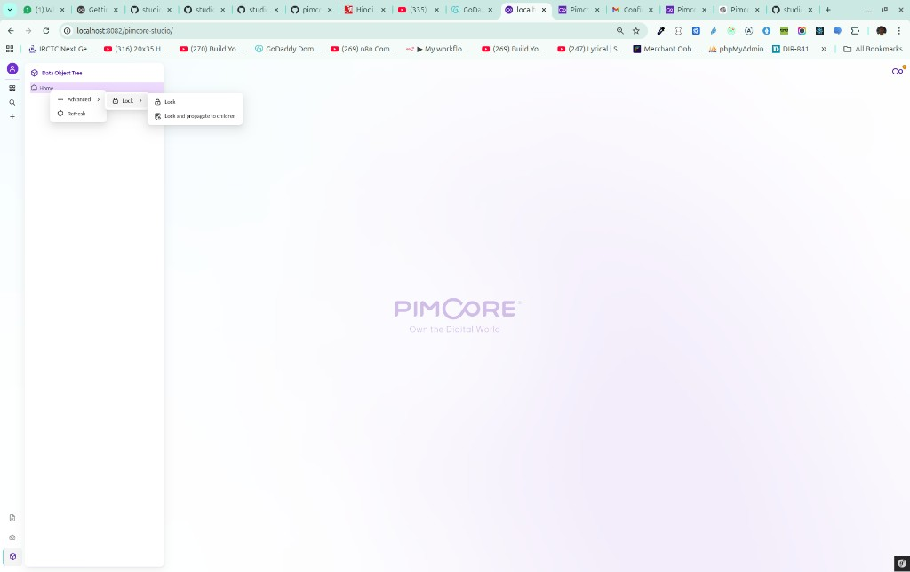

# Ayra Bundle — Pimcore Studio plugin guide

Short landing page (same bundle, fewer details): [README.md](../README.md).  
**India state & city selects:** [SELECT_OPTIONS_INDIA.md](SELECT_OPTIONS_INDIA.md).

This guide is for anyone who wants to **use** or **copy** this bundle. You do not need to know every detail up front: follow the **folder map**, then the **quick start**, then read more only if you need to change behaviour.

---

## What this bundle does (in one sentence)

It adds a **small icon** in Pimcore Studio’s **left sidebar**. When you click it, the browser shows a **simple alert**. Behind that, PHP tells Pimcore **where the built JavaScript lives**, and Studio **loads that script** as a plugin. The bundle also provides **India state / city** select **option providers** for data objects (see [SELECT_OPTIONS_INDIA.md](SELECT_OPTIONS_INDIA.md)).

---

## Folder structure (start here)

Everything for this example lives under **`bundles/ayra-bundle/`** in your project (next to `src/`, `config/`, `vendor/`, etc.).

```text
bundles/ayra-bundle/
├── composer.json                 # Package name, Pimcore bundle registration (extra.pimcore.bundles)
├── config/
│   └── services.yaml             # Symfony services: Webpack entry + India option providers
├── doc/
│   ├── STUDIO_PLUGIN.md          # This file
│   ├── SELECT_OPTIONS_INDIA.md   # India state/city select option providers
│   └── images/                   # Screenshots for the guide (optional)
├── public/
│   └── studio/
│       └── build/
│           └── <random-id>/      # Created by `npm run build` — contains entrypoints.json + JS
├── src/
│   ├── AyraBundle.php            # Main Symfony / Pimcore bundle class
│   ├── DataObject/               # India state/city option providers + geography data
│   ├── DependencyInjection/
│   │   └── AyraExtension.php     # Loads config/services.yaml
│   └── Webpack/
│       └── WebpackEntryPointProvider.php   # Points Pimcore at entrypoints.json under public/studio/build
└── assets/
    └── studio/                   # Frontend project (npm lives here)
        ├── package.json
        ├── rsbuild.config.ts     # Build config: Module Federation + entrypoints for Pimcore
        └── js/
            └── src/
                ├── main.ts       # Build entry (minimal)
                └── plugins.tsx   # Your Studio plugin: sidebar icon + alert
```

**How to read this tree**

| Location | Role in plain words |
|----------|---------------------|
| **`assets/studio/`** | Where you edit **TypeScript/React** and run **`npm install`** / **`npm run build`**. |
| **`public/studio/build/<id>/`** | Where the **build output** goes. Pimcore cares about **`entrypoints.json`** here. |
| **`src/Webpack/WebpackEntryPointProvider.php`** | Tells Pimcore: “look for **`entrypoints.json`** in those build folders.” |
| **`config/services.yaml`** | Registers **WebpackEntryPointProvider** (Studio JS) and **option provider** services. |
| **`plugins.tsx`** | The actual **plugin**: register an icon on the **left sidebar** slot. |

---

## Quick start (use the bundle as-is)

Do these in order from the **project root** (`my-project/`), not only inside the bundle.

1. **Composer** — root `composer.json` must require the path package and list the path repo (already set up in this skeleton). Then install:

   ```bash
   composer update ayra/ayra-bundle
   ```

2. **Enable the bundle** — in **`config/bundles.php`** you should have:

   ```php
   Ayra\Bundle\AyraBundle\AyraBundle::class => ['all' => true],
   ```

3. **Build the Studio UI assets** (writes `bundles/ayra-bundle/public/studio/build/<id>/…`, then **copies** that output to **`public/bundles/ayra/studio/build/`** so URLs like `/bundles/ayra/studio/build/<id>/exposeRemote.js` resolve):

   ```bash
   cd bundles/ayra-bundle/assets/studio
   npm install
   npm run build
   ```

   If you ever run **`rsbuild build`** without npm’s **`postbuild`** hook, copy manually or from project root run **`bin/console assets:install public`** (inside Docker: `docker compose exec php php bin/console assets:install public`) so **`public/bundles/ayra`** stays in sync.

4. **Clear cache** (and **`assets:install`** if you skipped the copy step):

   ```bash
   bin/console cache:clear
   bin/console assets:install public
   ```

5. **Open Pimcore Studio** in the browser — you should see the extra icon on the **left**; click it → **alert**.

If something is missing, use the **checklist** at the bottom of this file.

---

## How the pieces connect (simple flow)

```text
  You run npm run build
           │
           ▼
  JS + entrypoints.json land in
  bundles/ayra-bundle/public/studio/build/<id>/
           │
           ▼
  npm postbuild copies into (same files nginx serves at /bundles/ayra/…)
  public/bundles/ayra/studio/build/<id>/
           │
           ▼
  (Alternatively: bin/console assets:install public)
  WebpackEntryPointProvider (PHP) says:
  "entrypoints are here" + entry name exposeRemote
           │
           ▼
  Pimcore Studio loads your remote and runs AyraStudioPlugin
           │
           ►
  plugins.tsx registers a component on the left sidebar slot
```

So: **build first**, then **PHP registration**, then **Studio** loads your script and your **`onInit`** code runs.

---

## Changing the icon or the click action

- **Icon / button UI:** edit **`bundles/ayra-bundle/assets/studio/js/src/plugins.tsx`** (the `AyraSidebarIcon` part).
- **After any TS/TSX change:** run **`npm run build`** again inside **`assets/studio/`**.

---

## Registering with Pimcore (slightly more detail)

### Composer

- Root **`composer.json`**: path repository → **`bundles/ayra-bundle`**, and **`"ayra/ayra-bundle": "*"`** in **`require`**.
- Bundle **`composer.json`**: **`extra.pimcore.bundles`** lists **`Ayra\Bundle\AyraBundle\AyraBundle`** so Pimcore discovers the bundle.

### Symfony

- **`config/bundles.php`**: enable **`AyraBundle`** (see Quick start).

### Studio JavaScript entry (PHP + YAML)

Pimcore Studio does not guess your JS path. You must:

1. Implement **`WebpackEntryPointProviderInterface`** (see **`src/Webpack/WebpackEntryPointProvider.php`**).
2. Tag that service in **`config/services.yaml`** with **`pimcore_studio_ui.webpack_entry_point_provider`**.

**Important file:** **`entrypoints.json`** inside each **`public/studio/build/<id>/`** folder. The provider’s **`getEntryPoints()``** returns **`['exposeRemote']`** so Pimcore loads the same entry name the Rsbuild Pimcore plugin generates.

---

## Local development (optional)

From **`bundles/ayra-bundle/assets/studio`**:

```bash
npm run dev-server
```

Default dev port is **3033** (Quill in this project often uses **3032**).

---

## Checklist if the sidebar icon does not show

| Check | What to verify |
|--------|-----------------|
| Build ran | A folder exists under **`bundles/ayra-bundle/public/studio/build/`** and contains **`entrypoints.json`**. |
| Assets installed | **`public/bundles/ayra/`** in the project contains the same **`studio/build/...`** files after **`assets:install`**. |
| Bundle active | **`AyraBundle`** is in **`config/bundles.php`** and **`composer update`** succeeded. |
| Cache | Run **`bin/console cache:clear`**. |

---

## Pimcore Studio: trees (Data Objects, Assets, Documents), locking, and unlock

This section is **not** specific to the Ayra sidebar demo. It explains behaviour you see in **Pimcore Studio** when working with the **element trees** (Data Object tree, Asset tree, Document tree): why **Lock** exists, how **Unlock** works, and what to try when a tree feels “wrong” or you cannot edit.

### Why Pimcore can “lock” an element

Locking is a **safety and collaboration** feature:

- **Avoid conflicting edits:** While something is locked (by you or another user, depending on setup), Pimcore can **block or warn** against changes so two people do not overwrite each other’s work.
- **Protect structure:** **“Lock and propagate to children”** applies the lock to the **selected folder/object and everything under it**, so a whole subtree stays consistent (for example before a big import or a release freeze).
- **Who can lock/unlock** depends on **permissions** and **who created the lock**. If you did not lock it yourself, you may need someone with the right role to unlock it.

So locking is **intentional**, not a random bug. If editing is disabled, checking lock state is one of the first things to verify.

### Data Object, Asset, and Document trees — same idea

In Studio, the **left tree** for **Data Objects**, **Assets**, and **Documents** follows the same broad pattern:

- **Right‑click** a node (or use its **context menu**) for actions such as **Refresh**, **Lock**, **Unlock**, and other **Advanced** entries.
- If something looks out of date, use **Advanced → Refresh** on that node before assuming the UI is broken.

There is no separate “asset document tree fix” built into Ayra Bundle. If the tree misbehaves, usual causes are **lock state**, **missing permissions**, **perspective** restrictions, or **stale UI** — try **refresh** and confirm you can **unlock** (see below).

### How to lock (example path in Studio)

On a tree item (e.g. **Home** under **Data Object Tree**):

1. Open the **context menu** on the element.
2. Choose **Advanced**.
3. Open **Lock** (submenu).
4. Choose either:
   - **Lock** — lock **only** this element.
   - **Lock and propagate to children** — lock this element **and all descendants** in the tree.

Example (Data Object Tree, **Advanced → Lock**):



### How to unlock

Unlock uses the **same area of the menu**, but the labels switch when the element is already locked:

1. **Context menu** on the locked element (or the folder you locked with propagation).
2. **Advanced**.
3. **Lock** submenu (Studio still groups lock/unlock actions here).
4. Choose:
   - **Unlock** — remove the lock from **this** element only (behaviour may depend on whether children were locked separately).
   - **Unlock and propagate to children** — unlock this element **and propagate** unlock to children, matching the “propagate” lock option.

If you do **not** see **Unlock**, the item may not be locked, your user may **lack permission**, or the lock was created in a way that only certain roles can clear.

### Docker: element is **still** locked (common fixes)

With **`docker compose`**, locks are stored in **MariaDB** (`db` service). The UI can look “stuck” if:

1. **A parent was locked with “propagate”** — you must **Unlock and propagate to children** on that **parent** (or the same user who locked it), not only on a child.
2. **Edit lock** — opening an element in an editor creates a row in **`edit_lock`**. It normally expires after about **an hour**, or clears for the **same browser session**. New browser / cleared cookies / another container handling the next request can make this feel inconsistent in Docker until the row expires.
3. **Permissions** — your Studio user must be allowed to unlock (try **admin** to rule this out).

**Nuclear option (local / dev only):** clear lock tables in the DB, then hard‑refresh Studio (`Ctrl+Shift+R`).

From the **project root** (where `docker-compose.yaml` is):

```bash
chmod +x .docker/clear-pimcore-locks.sh   # once
./.docker/clear-pimcore-locks.sh
```

That runs **`DELETE FROM tree_locks;`** and **`DELETE FROM edit_lock;`** via **`.docker/clear-pimcore-locks.sql`**. **Do not use this on production** without understanding the impact.

One‑liner equivalent:

```bash
docker compose exec -T db mysql -upimcore -ppimcore pimcore -e "DELETE FROM tree_locks; DELETE FROM edit_lock;"
```

**File permission tip:** if PHP cannot write **`var/`** (cache, sessions) because files were created as **root** inside the container, uncomment **`user: '1000:1000'`** (use your host **`id -u`:`id -g`**) on the **`php`** and **`supervisord`** services in **`docker-compose.yaml`**, then recreate containers. Mis‑owned **`var/sessions`** can contribute to odd session behaviour.

### Quick reference: useful `bin/console` commands

Run these from the **project root** (where **`bin/console`** lives). Replace **`bin/console`** with **`php bin/console`** if your shell does not find `bin/console`.

| Command | What it does |
|--------|----------------|
| **`cache:clear`** | Clears the **Symfony / Pimcore application cache**. Use after config, bundle, or route changes when behaviour looks “stuck” or old. |
| **`assets:install`** | Publishes **public assets** from bundles (including `public/` from `ayra-bundle`) into **`public/bundles/...`** so URLs like `/bundles/ayra/...` work. |
| **`cache:warmup`** | **Rebuilds** the cache after a clear (optional; can make the first request faster). |
| **`debug:router`** | Lists **HTTP routes** (helps verify Studio or API routes are registered). |
| **`debug:container`** | Shows **services**; add a name fragment to search (advanced troubleshooting). |
| **`doctrine:migrations:status`** | Shows whether **database migrations** are pending (needs a working DB connection). |
| **`doctrine:migrations:migrate`** | **Applies** pending migrations (changes DB schema; use with care, usually on deploy). |

Pimcore‑oriented commands (names can vary slightly by version; run **`bin/console list pimcore`** when the database is available):

| Command | What it does |
|--------|----------------|
| **`pimcore:deployment:classes-rebuild`** | **Regenerates** PHP model classes from **Class definitions** (Data Objects). Use after changing class definitions in admin. |
| **`pimcore:cache:clear`** | Clears **Pimcore‑specific** caches (full page cache, etc., depending on configuration). |

**Ayra bundle workflow (short):** run **`npm run build`** in **`bundles/ayra-bundle/assets/studio`** — **`postbuild`** copies output into **`public/bundles/ayra/studio/build/`** so `/bundles/ayra/studio/build/<uuid>/exposeRemote.js` exists. Then **`cache:clear`**. Use **`assets:install`** if you skipped **`npm run build`** or copied files manually.

---

## OpenSearch: `index_not_found` when saving a data object

If Studio reports **`index_not_found_exception`** for an index like **`pimcore_data-object_products`**, the **Generic Data Index** has no index for that class yet. See the project guide: **[doc/GENERIC_DATA_INDEX.md](../../doc/GENERIC_DATA_INDEX.md)** (create indices with **`generic-data-index:update:index`**, run **Messenger** consumers).

---

## Further reading (official Pimcore links)

- [How to Add an Entry to the Left Sidebar](https://github.com/pimcore/studio-ui-bundle/blob/2026.x/doc/04_Extending/02_Plugin_Development_Examples/02_Add_an_Entry_to_the_Left_Sidebar.md)
- [Left sidebar example (GitHub)](https://github.com/pimcore/studio-example-bundle/tree/main/assets/js/src/examples/left-sidebar)
- [WebpackEntryPointProvider in studio-example-bundle](https://github.com/pimcore/studio-example-bundle/blob/main/src/Webpack/WebpackEntryPointProvider.php)
- [Service tag example](https://github.com/pimcore/studio-example-bundle/blob/5715004cf377e91adfd1fce68b054181046edbc0/config/services.yaml#L12-L14)
- [Component Registry (Studio UI)](https://github.com/pimcore/studio-ui-bundle/blob/2026.x/doc/01_Architecture_Overview/01_SDK_Overview/04_Component_Registry.md)

**Note:** `pimcore/quill-bundle` may add a second tag for the **document editor iframe**. Only add that if you need the same remote inside the iframe; this Ayra example uses the main tag only.
